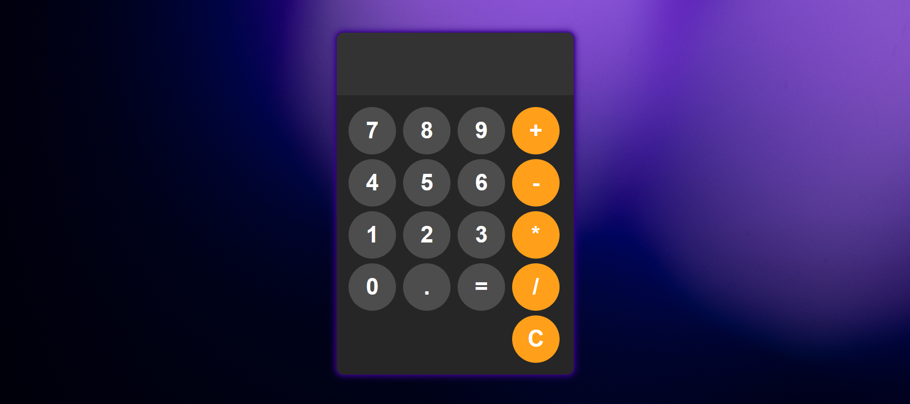
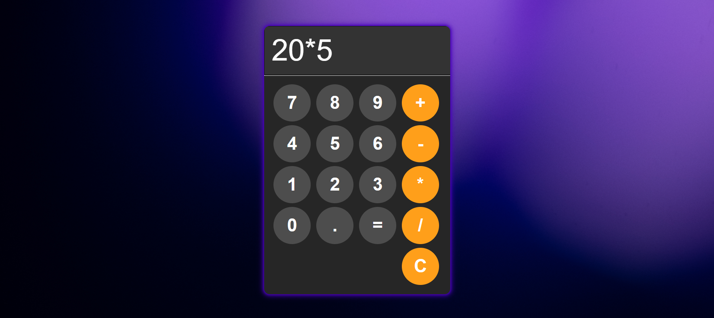

# Calculator-App

This is a simple calculator built with **HTML**, **CSS**, and **JavaScript**. It features a dynamic neon border with smooth animations and supports basic arithmetic operations.

## Getting Started

To get started, just open the project files in your browser:

1. Download or clone the repository.
2. Open `index.html` in your browser.

You can start editing the HTML, CSS, or JavaScript files to customize the design or functionality.

## Screenshots

Here are some screenshots of the project:

## Project Features

- Basic arithmetic operations (+, -, *, /)
- Smooth animations with neon-style borders
- Responsive design

## Contribute

Feel free to fork the project, contribute, or report any issues on the [GitHub repository](https://github.com/your-username/neon-calculator).

## License

This project is open-source and available under the [MIT License](LICENSE).
